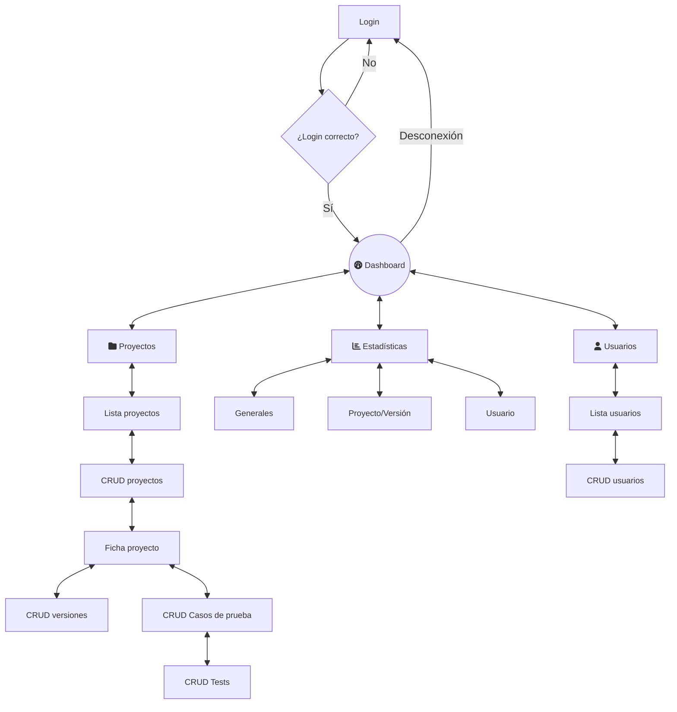
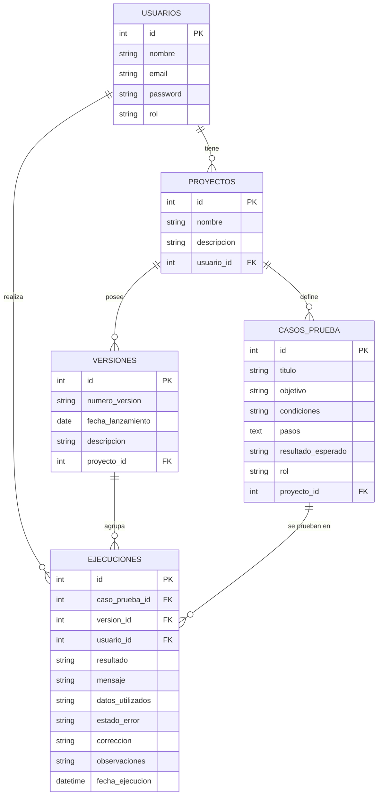

<<<<<<< HEAD
# TestLab

**TestLab** es una aplicación web diseñada para facilitar el registro, ejecución y seguimiento de pruebas de software en entornos de desarrollo. Su objetivo principal es mejorar la trazabilidad de los test y centralizar la información que, tradicionalmente, se gestiona de manera dispersa en hojas de cálculo o documentos.

Actualmente, muchos equipos carecen de un sistema unificado para documentar y controlar los resultados de las pruebas, lo que provoca:

* Falta de organización
* Dificultad para identificar errores recurrentes
* Problemas de comunicación entre desarrolladores, testers y gestores de proyectos

**TestLab** pretende solucionar estas necesidades mediante un sistema estructurado que permite:

* Registrar de forma uniforme los casos de prueba y sus resultados
* Asociar cada prueba a una versión o proyecto concreto
* Consultar el historial de ejecuciones y su trazabilidad
* Generar estadísticas globales sobre el estado de las pruebas
* Mejorar la comunicación interna y la calidad final del software

Los principales beneficiarios son equipos de desarrollo, testers, gestores de proyectos y clientes que deseen una visión clara y actualizada del estado de las pruebas.

## Diagrama de flujo previsto

## Diagrama E-R previsto

=======

## About Laravel

Laravel is a web application framework with expressive, elegant syntax. We believe development must be an enjoyable and creative experience to be truly fulfilling. Laravel takes the pain out of development by easing common tasks used in many web projects, such as:

- [Simple, fast routing engine](https://laravel.com/docs/routing).
- [Powerful dependency injection container](https://laravel.com/docs/container).
- Multiple back-ends for [session](https://laravel.com/docs/session) and [cache](https://laravel.com/docs/cache) storage.
- Expressive, intuitive [database ORM](https://laravel.com/docs/eloquent).
- Database agnostic [schema migrations](https://laravel.com/docs/migrations).
- [Robust background job processing](https://laravel.com/docs/queues).
- [Real-time event broadcasting](https://laravel.com/docs/broadcasting).

Laravel is accessible, powerful, and provides tools required for large, robust applications.

## Learning Laravel

Laravel has the most extensive and thorough [documentation](https://laravel.com/docs) and video tutorial library of all modern web application frameworks, making it a breeze to get started with the framework. You can also check out [Laravel Learn](https://laravel.com/learn), where you will be guided through building a modern Laravel application.

If you don't feel like reading, [Laracasts](https://laracasts.com) can help. Laracasts contains thousands of video tutorials on a range of topics including Laravel, modern PHP, unit testing, and JavaScript. Boost your skills by digging into our comprehensive video library.

## Laravel Sponsors

We would like to extend our thanks to the following sponsors for funding Laravel development. If you are interested in becoming a sponsor, please visit the [Laravel Partners program](https://partners.laravel.com).

### Premium Partners

- **[Vehikl](https://vehikl.com)**
- **[Tighten Co.](https://tighten.co)**
- **[Kirschbaum Development Group](https://kirschbaumdevelopment.com)**
- **[64 Robots](https://64robots.com)**
- **[Curotec](https://www.curotec.com/services/technologies/laravel)**
- **[DevSquad](https://devsquad.com/hire-laravel-developers)**
- **[Redberry](https://redberry.international/laravel-development)**
- **[Active Logic](https://activelogic.com)**

## Contributing

Thank you for considering contributing to the Laravel framework! The contribution guide can be found in the [Laravel documentation](https://laravel.com/docs/contributions).

## Code of Conduct

In order to ensure that the Laravel community is welcoming to all, please review and abide by the [Code of Conduct](https://laravel.com/docs/contributions#code-of-conduct).

## Security Vulnerabilities

If you discover a security vulnerability within Laravel, please send an e-mail to Taylor Otwell via [taylor@laravel.com](mailto:taylor@laravel.com). All security vulnerabilities will be promptly addressed.

## License

The Laravel framework is open-sourced software licensed under the [MIT license](https://opensource.org/licenses/MIT).
>>>>>>> backend-local
